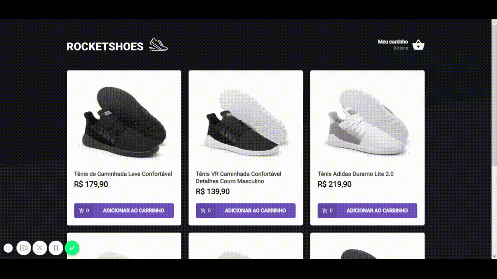

<h1 align="center">
    
</h1>

<h3 align="center">
  Código feito com as Aulas do 7° Módulo do Bootcamp - GoStack
</h3>

<blockquote align="center">“Sua única limitação é você mesmo”!</blockquote>

  <a href="#dart-sobre-o-projeto">Sobre o projeto</a>&nbsp;&nbsp;&nbsp;|&nbsp;&nbsp;&nbsp;
  <a href="#rocket-principais-tecnologias" > Principais tecnologias </a>&nbsp;&nbsp;&nbsp;|&nbsp;&nbsp;&nbsp;
  <a href="#fire-sobre-o-desafio" > Sobre o desafio </a>&nbsp;&nbsp;&nbsp;|&nbsp;&nbsp;&nbsp;
  <a href="#memo-license"> License </a>

## :dart: Sobre o projeto

O projeto foi criar uma interface de um ecommerce onde fosse possível adicionar produtos ao carrinho.

Para fazer essa funcionalidade foi utilizado o redux e redux-saga!

Para instalar e executar o projeto você precisa:

1. Fazer um clone desse repositório;
2. Entrar na pasta rodando `cd react-gostack-redux`;
3. Rodar `yarn` para instalar as dependências;
4. Iniciar o server rodando `json-server server.json -p 3333 -d 1000` *
5. Rodar `yarn start` para iniciar o frontend.

_OBS: Para rodar o json-server você precisa ter ele instalado_  `yarn global add json-server`

## :rocket: Principais tecnologias

- [React](https://pt-br.reactjs.org)

- [Redux](https://redux.js.org)

- [Redux Saga](https://redux-saga.js.org)

## :fire: Sobre o desafio

O desafio do sétimo módulo era fazer o mesmo projeto, porém para uma versão mobile, utilizando **react-native** :iphone: :iphone:

Para dar uma olhada :point_right: [Clique Aqui](https://github.com/maurodesouza/mobile-gostack-redux-challenge) :point_left:

## :memo: License

Esse projeto está sob licença MIT. Veja o arquivo [LICENSE](LICENSE.md) para mais detalhes.

---

Feito com :heart: by Mauro de Souza - Email: maurodesouza2017@hotmail.com
